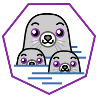

# EXPERIMENT PODMAN

## TABLE OF CONTENTS

[Install](notebook/install.md)

[Practice #1](notebook/practice-1.md)  
[Practice #2](notebook/practice-2.md)  
[Practice #3](notebook/practice-3.md)

## REFERENCES

https://podman.io  
https://podman.io/docs  
https://docs.podman.io/en/latest  
https://docs.podman.io/en/latest/Commands.html  
https://docs.podman.io/en/latest/Reference.html  
https://docs.podman.io/en/latest/Tutorials.html  
https://github.com/containers/podman/blob/main/docs/tutorials/basic_networking.md

https://www.youtube.com/playlist?list=PLn6POgpklwWo_IZ1s2v1Ijf-SnPQY8J57

&nbsp;

`-`

>   
> Ghislain Bernard
>
> 
> 
> 

[MIT License](https://opensource.org/license/mit)

`c[_] 2025`
